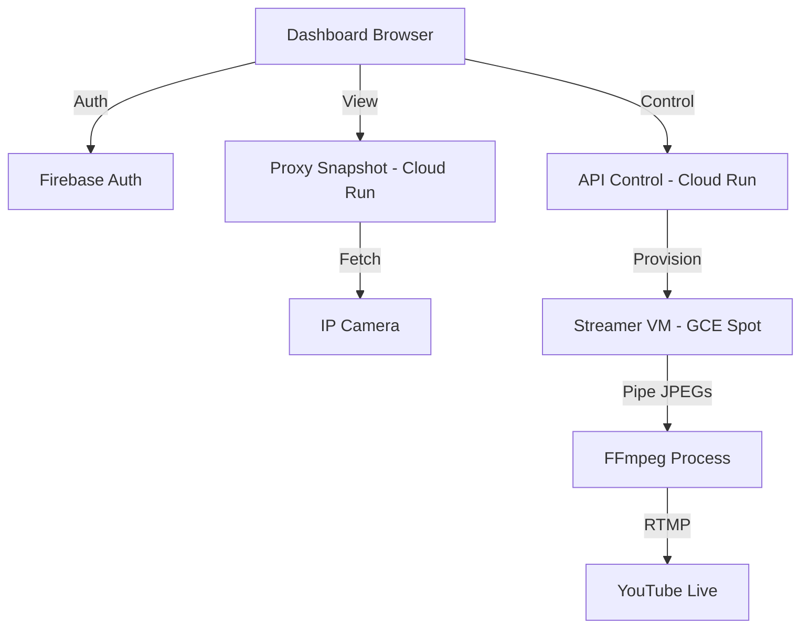

# 📸 Caca-Cam: Automated Camera Streaming System

An intelligent camera monitoring and streaming system that provisions dynamic Google Cloud Platform (GCP) Spot VMs to stream camera snapshots to YouTube Live.

## 🚀 Overview

The project consists of three main components:
1.  **Dashboard (Firebase Hosting)**: A glassmorphism-styled web interface to monitor cameras and control streams.
2.  **API Control (Cloud Run)**: The orchestrator that manages VM life cycles, checking for health and provisioning.
3.  **Proxy Snapshot (Cloud Run)**: A security layer that proxies camera images to bypass CORS and Mixed Content (HTTP/HTTPS) issues.
4.  **Streamer VM (GCE)**: Ephemeral Spot VMs created on-demand to run FFmpeg and pipe snapshots to YouTube.

---

## 🏗 Architecture



---

## 🛠 Prerequisites

-   **Google Cloud Project**: With Billing, Compute Engine, and Cloud Run APIs enabled.
-   **Firebase**: Project initialized with Hosting and Auth.
-   **Docker**: To build microservice images.
-   **GCloud SDK**: Configured with your project.

---

## ⚙️ Configuration

### Environment Variables (api-control)
The control logic uses the following internal constants (update in `functions/api-control/index.js`):
-   `PROJECT_ID`: `paineiras-cam`
-   `ZONE`: `southamerica-east1-a`
-   `SA_EMAIL`: Service Account with Compute Admin permissions.

### Firebase Whitelist
Users must be added to the `allowed_users` collection in Firestore to access the dashboard.

---

## 📦 Deployment

### Automated CI/CD (Cloud Build)
The project is configured to work with a unified Cloud Build trigger. To set it up:

1.  **Connect Repo**: Go to [Cloud Build -> Triggers](https://console.cloud.google.com/cloud-build/triggers).
2.  **Auth**: If not already connected, connect your GitHub repository `ricardo7k/caca-cam`.
3.  **Manual Trigger Creation**:
    - **Name**: `main-deploy`
    - **Event**: `Push to a branch`
    - **Branch**: `^main$`
    - **Configuration**: `Cloud Build configuration file (yaml)`
    - **Cloud Build configuration file location**: `/cloudbuild.yaml`
4.  **Required Secret**: The build expects a secret named `FIREBASE_TOKEN` in Secret Manager (already created and populated during setup).
5.  **Permissions**: The Cloud Build service account has been granted `Secret Manager Secret Accessor` and `Firebase Admin` roles.

### Manual Deployment (Alternative)
If you need to deploy manually:

**Deploy API Control:**
```bash
cd functions/api-control
gcloud run deploy api-control --source . --region southamerica-east1
```

**Deploy Proxy Snapshot:**
```bash
cd functions/proxy-snapshot
gcloud run deploy proxy-snapshot --source . --region southamerica-east1
```

**Deploy Dashboard:**
```bash
firebase deploy --only hosting
```

---

## 🤝 Project Structure

-   `/functions/api-control`: Logic for VM management and status polling.
-   `/functions/proxy-snapshot`: Image proxy server.
-   `/streamer/public`: Frontend dashboard source.
-   `/scripts`: Utilities for IP discovery and local testing.

---

## 📝 Maintenance

-   **Node Version**: Both microservices run on **Node 22** via Docker to ensure long-term support.
-   **Regions**: Primary infrastructure is centered in `southamerica-east1` (São Paulo) for low latency.
